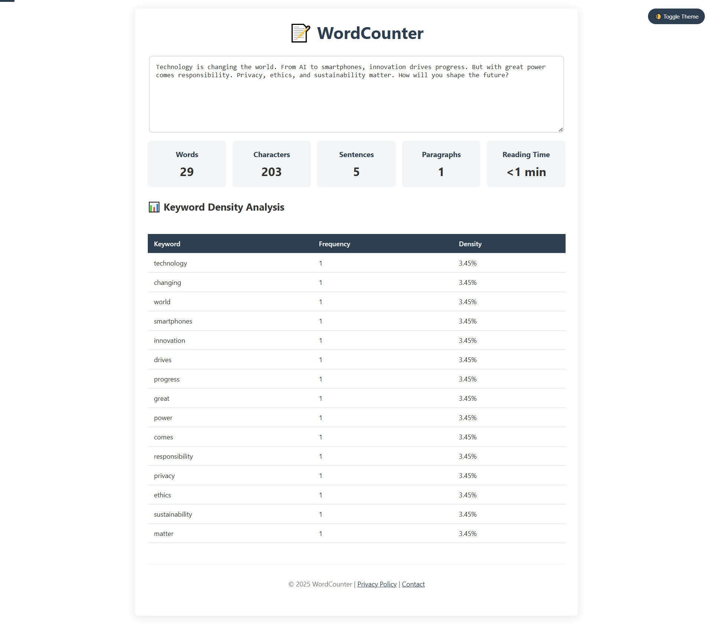

# Word Counter

A Django-based web application that allows users to input text and get word count statistics, including total words, characters, sentences, paragraphs, reading time, and keyword density analysis.

## Project Screenshot


## Features
- Count total words, characters, sentences, and paragraphs.
- Calculate estimated reading time.
- Display keyword frequency and density.
- Toggle between light and dark themes.
- Live text analysis with real-time updates.

## Installation

### Prerequisites
Ensure you have Python and Django installed on your system:
```sh
python -m venv venv  # Create a virtual environment
source venv/bin/activate  # Activate (Linux/macOS)
venv\Scripts\activate  # Activate (Windows)
pip install django  # Install Django
```

### Clone the Repository
```sh
git clone https://github.com/aqibcs/wordcounter-django.git
cd wordcounter
```

### Run the Django Server
```sh
python manage.py runserver
```
Access the app at `http://127.0.0.1:8000/`

## Usage
1. Open the app in a browser.
2. Enter or paste text into the textarea.
3. View real-time word count statistics and keyword density analysis.
